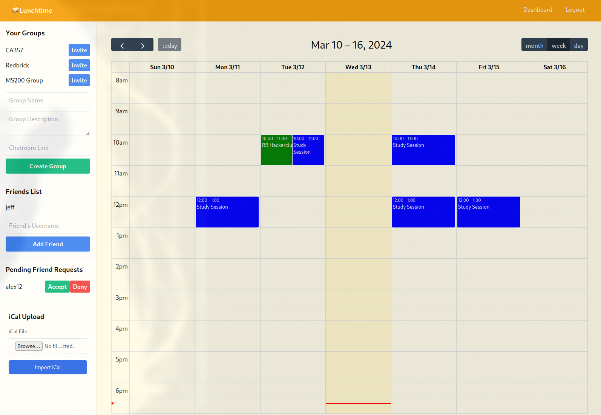
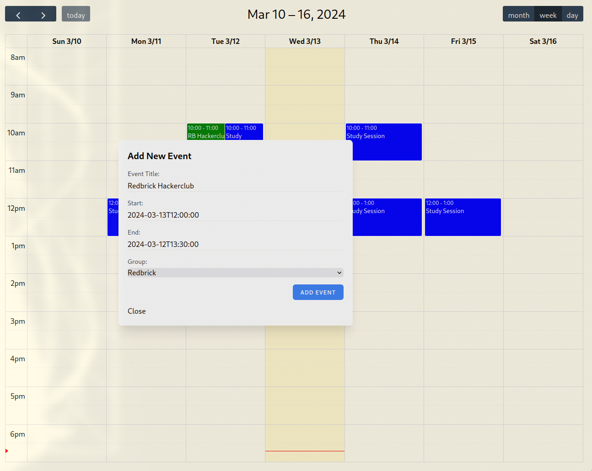
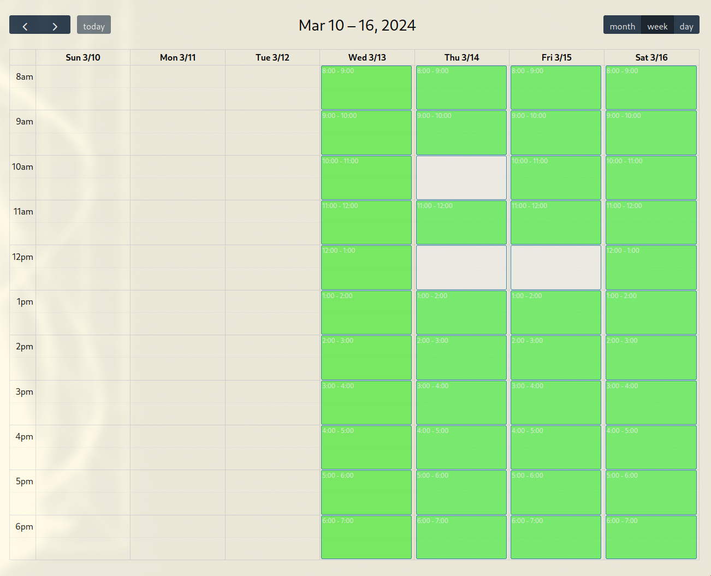

**Note:** This project is currently a work in progress and serves as a proof of concept. As such, the visuals may appear lacklustre and certain functionalities, such as account settings and group settings, are not yet available. These features are planned for future development. We appreciate your understanding and patience as we continue to improve and expand the system.

# Project Overview
## Dashboard
Dashboard Overview

The dashboard provides a comprehensive view of the system's current state. It displays user information such as the groups they created or are a part of, friendslist as well as pending friend requests.

Additionally, there is an option to upload an iCal file which can be used to import events from external calendar sources such as Google Calendar, or calendar (.ics) invites sent in emails.

## Calendar Add Event Modal

When you click on a free hour cell in the calendar, an "Add Event" modal appears. This feature allows users to schedule new events directly from the dashboard. The modal includes fields for the event name, group name, start and end times.

## Calendar Heatmap View

The calendar heatmap view provides a visual representation of group availability. Green cells indicate times when the entire group is available. This feature makes it easy to identify the best times for scheduling group events.

## System Architecture
The system architecture consists of a Flask backend/API and a frontend built with JavaScript and jQuery, incorporated into Flask templates.

### Flask Backend/API
The Flask backend handles all server-side operations. It processes requests, interacts with the database, and returns responses. The API provides endpoints for the frontend to interact with the backend.

### JS + jQuery Frontend
The frontend is built with JavaScript and jQuery and is incorporated into Flask templates. It provides a dynamic and interactive user interface, making requests to the backend and updating the UI based on the responses.